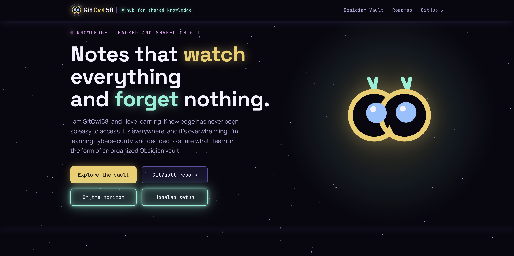

# gitowl58

Welcome to the hub. This is where I collect and share what I'm learning as I go. 
A living index, not a finished product.

## What's here

**Vault** — links out to my personal knowledge vault: notes, references, and the 
connections each new note creates.

**Homelab** — documentation of my home lab setup as it evolves: architecture, configs,
 lessons learned...))

**Cyber modules** — write-ups and notes on new topics/modules as I work through them. 

## Why

I have little free time but I always used it as well as I could, learning, discovering,
 and if it's useful to anyone else around, even better.

## Status

🦉 Actively under construction. Structure and content will grow slowly, steadily.

---

*Built and maintained by [gitowl58](https://gitowl58.com)*
